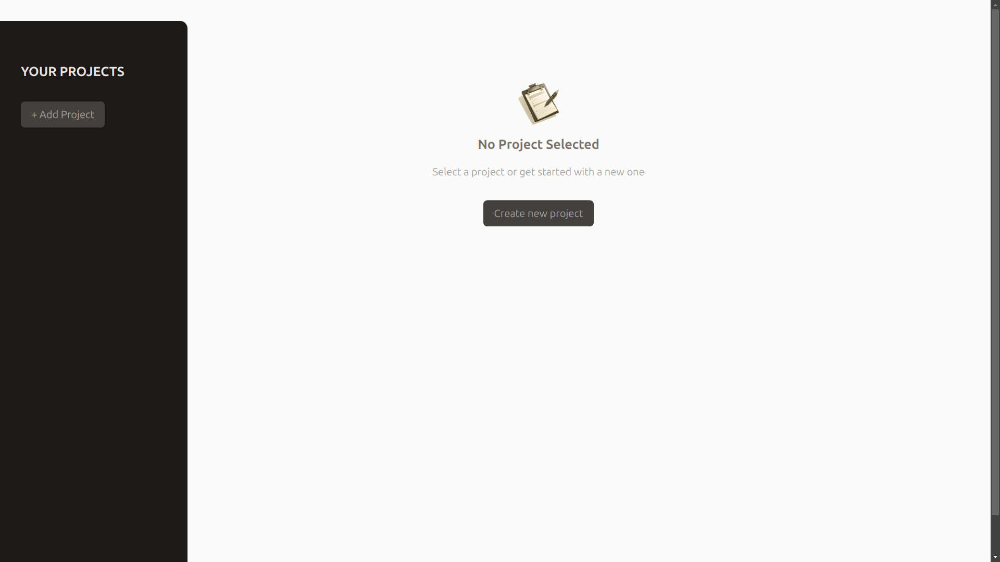
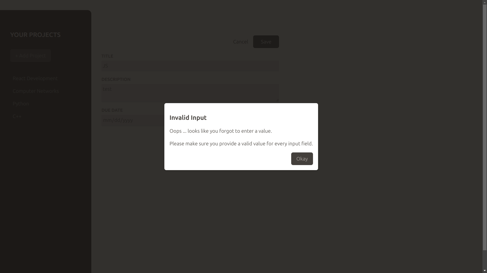
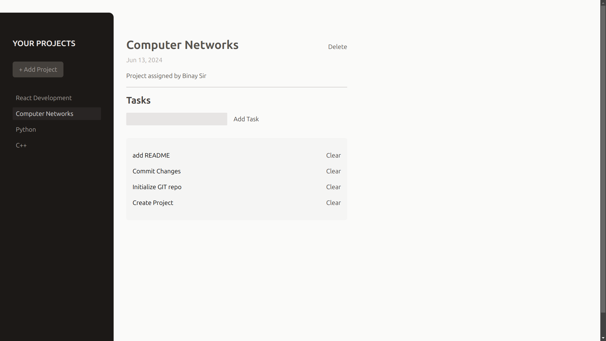

# Project Management App

This is a simple project management app built using React. The app allows users to create, select, and manage multiple projects, as well as add and delete tasks within each project.





## Features

- **Add Projects**: Create new projects with unique tasks.
- **Select Projects**: Switch between different projects to manage tasks specific to each one.
- **Add Tasks**: Add tasks to a selected project.
- **Delete Tasks**: Remove tasks from a selected project.
- **Delete Projects**: Delete projects entirely along with their associated tasks.

## Technologies Used

- **React**: The UI library for building components and managing state.
- **JavaScript (ES6+)**: Core language used for functionality.
- **CSS**: Used for basic styling.

## Components

- **App**: The main component that manages the state for the projects and tasks.
- **NewProject**: Renders the form for adding new projects.
- **NoProjectSelected**: Displays when no project is selected and prompts the user to create or select a project.
- **ProjectsSidebar**: Lists all the projects and allows the user to select a project.
- **SelectedProject**: Displays the selected project's tasks and provides options to add or delete tasks.

## State Management

The app uses React's `useState` hook to manage the state of projects and tasks.

- **State Object**:
  - `selectedProjectId`: Stores the ID of the currently selected project.
  - `projects`: An array of project objects.
  - `tasks`: An array of task objects associated with each project.

## Functionality

- **Add Task** (`handleAddTask`): Adds a new task to the selected project.
- **Delete Task** (`handleDeleteTask`): Removes a task from the selected project.
- **Select Project** (`handleSelectProject`): Selects a project from the sidebar.
- **Start Add Project** (`handleStartAddProject`): Opens the form to add a new project.
- **Cancel Add Project** (`handleCancelAddProject`): Cancels the process of adding a new project.
- **Add Project** (`handleAddProject`): Adds a new project to the list of projects.
- **Delete Project** (`handleDeleteProject`): Deletes the currently selected project and its associated tasks.

## Setup and Installation

1. **Clone the repository:**

   ```bash
   git clone https://github.com/itsrajadarsh/react.git
   ```

2. **Navigate into the project directory:**

   ```bash
   cd projectManagement
   ```

3. **Install dependencies:**

   ```bash
   npm install
   ```

4. **Run the development server:**

   ```bash
   npm run dev
   ```

   Open `http://localhost:5173/` in your browser to view the application.

## Contributing

Contributions are welcome! Please open an issue or submit a pull request if you have suggestions or improvements.

## Acknowledgements

- Built with React for learning and demonstration purposes.

## Contact

For questions or feedback, please reach out via [adarshraj6113@gmail.com] or open an issue on the [GitHub repository](https://github.com/itsrajadarsh/react/tree/main/projectManagement).
