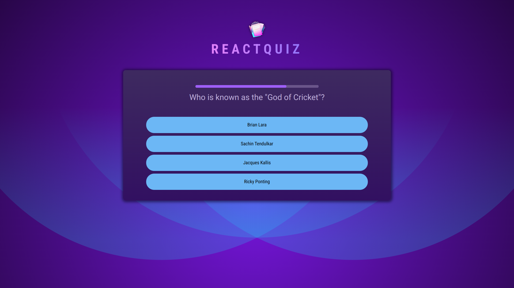

# Quiz Application

A React-based quiz application that dynamically renders questions, tracks user responses, provides timing controls for each question, and displays a summary at the end. This app supports skipping questions and provides feedback on correct and incorrect answers.




## Features

- **Dynamic Question Rendering**: Displays questions one at a time from a question bank.
- **Answer Selection**: Allows users to select answers or skip questions.
- **Timer per Question**: Each question has a timer, which updates based on whether the user has answered or skipped the question.
- **Result Summary**: After all questions are answered, the app displays the percentage of correct answers, skipped answers, and incorrect answers.
- **Randomized Answers**: Shuffles answers each time a question is displayed to prevent memorization of answer order.

## Demo

- https://
  _Try to stop the timer as close to zero as possible!_

## Components

### 1. `Quiz`

The main component that manages the quiz state and navigation through questions.

- Uses `useState` to track user answers.
- Uses `useCallback` to handle answer selection and skipping.
- Renders the `Question` component for each question and the `Summary` component upon quiz completion.

### 2. `Question`

Displays a single question with multiple answer choices.

- **Timer**: Renders a `QuestionTimer` that tracks remaining time for each question.
- **Answer Handling**: Uses `Answers` component to render answer options. Calls `handleSelectAnswer` when an answer is chosen, checking if the answer is correct.

### 3. `QuestionTimer`

A progress bar-based countdown timer.

- Automatically skips to the next question when time runs out.
- Decreases time incrementally and stops when the answer is selected.

### 4. `Answers`

Renders answer choices as buttons.

- Shuffles answers to randomize answer order each time the question is rendered.
- Displays different styles based on whether the answer is correct, incorrect, selected, or unanswered.

### 5. `Summary`

Displays the user's results at the end of the quiz.

- Calculates the percentage of correct, skipped, and incorrect answers.
- Shows a detailed list of questions with the correct answer and user’s choice.

## How to Run the Project

1. Clone the repository:
   ```bash
   git clone https://github.com/itsrajadarsh/react.git
   ```
2. Navigate to the project directory:
   ```bash
   cd reactQuiz
   ```
3. Install the dependencies:
   ```bash
   npm install
   ```
4. Start the development server:
   ```bash
   npm run dev
   ```
5. Open your browser and go to `http://localhost:5173/` to start the game.

## Usage

- Answer each question or skip if desired.
  The timer will count down for each question; if time runs out, the question is skipped.
  Once all questions are answered or skipped, the summary page will show your performance.
  Example Questions File (questions.js)
  The app expects a list of questions in a file like questions.js in the following format:

  export default [
  {
  id: 'q1',
  text: 'Question text here?',
  answers: ['Correct Answer', 'Wrong Answer 1', 'Wrong Answer 2', 'Wrong Answer 3'],
  },
  // More questions...
  ];

- The correct answer should always be the first item in the answers array.
