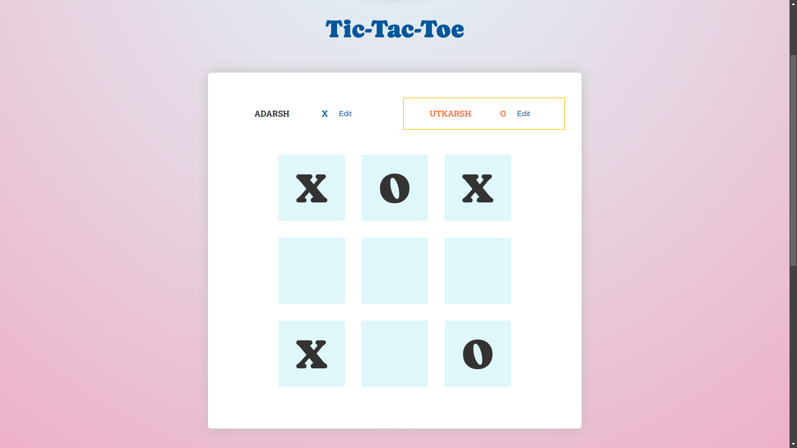

# Tic-Tac-Toe React Project

A simple Tic-Tac-Toe game built with React. This project demonstrates basic game functionality including player turns, game status updates, and move history.



## Features

- **Two Player Mode:** Play with two players who take turns.
- **Dynamic Player Names:** Customize player names.
- **Game Status:** Displays the winner or a draw when the game ends.
- **Move History:** Tracks and displays the history of moves.

## Demo

You can try out the live demo of the game here: [Tic-Tac-Toe Demo](https://tictactoe-x-o.vercel.app/)

## Components

- **`App`**: Manages game state and renders the main application view.
- **`Player`**: Displays player information and allows name changes.
- **`GameBoard`**: Renders the game board and handles square selections.
- **`Log`**: Displays the history of moves made during the game.
- **`GameOver`**: Shows the result of the game and provides an option to restart.

## Setup and Installation

1. **Clone the repository:**

   ```bash
   git clone https://github.com/itsrajadarsh/react.git
   ```

2. **Navigate into the project directory:**

   ```bash
   cd ticTacToe
   ```

3. **Install dependencies:**

   ```bash
   npm install
   ```

4. **Run the development server:**

   ```bash
   npm run dev
   ```

   Open `http://localhost:5173/` in your browser to view the application.

## Code Overview

- **`App.js`**: Contains the main logic for the game including player turns, game board updates, and determining the winner.
- **`components/Player.jsx`**: Renders player details and handles name changes.
- **`components/GameBoard.jsx`**: Displays the Tic-Tac-Toe grid and allows players to make moves.
- **`components/Log.jsx`**: Lists all moves made during the game.
- **`components/GameOver.jsx`**: Displays the outcome of the game and provides a restart button.
- **`winning-combinations.js`**: Defines all possible winning combinations for the game.

## Winning Combinations

The winning combinations are defined in `winning-combinations.js`. This file includes all possible ways to win in a Tic-Tac-Toe game.

## Contributing

Contributions are welcome! Please open an issue or submit a pull request if you have suggestions or improvements.

## Acknowledgements

- Inspired by classic Tic-Tac-Toe games.
- Built with React for learning and demonstration purposes.

## Contact

For questions or feedback, please reach out via [adarshraj6113@gmail.com] or open an issue on the [GitHub repository](https://github.com/itsrajadarsh/react/tree/main/ticTacToe).
